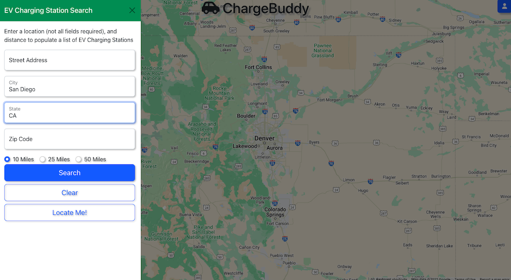
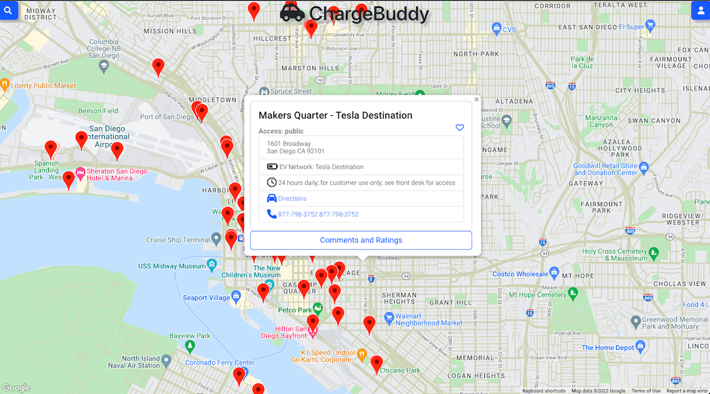

# Charge-Buddy

## Introduction:

Charge-Buddy is an application designed to allow users to locate Electric Vehicle Charging Stations in their area. Users can enter their full or partial address, distance, and obtain a list of EV Stations. The Stations are displayed on a Google Map, and clicking a pin will display quick-facts about the station, allow users to comment, rate, and save to favorites.

## Live Demo:

A live version of this project is avaialbe at: https://chargebuddy.netlify.app/

## Features:

- Locate EV Charging Stations in your area
  - Search by address
  - Use the "locate me" option
- Create an account
  - Session/cookie creation to keep user logged in for 24-hours
  - Username and password requirements and logic checks
- Save stations to your favorites
  - Favorites allow quick-access to station information in the User Account page
  - Remove favorites either from the quick-facts pop-up or your account page
- Add comments and ratings to stations
- Edit comment and rating

## Technologies Used:

Charge-Buddy was developed utilizing the MERN stack.

## Dependencies:

### Front-End:

- "@react-google-maps/api": "^2.12.0",
- "axios": "^0.27.2",
- "bootstrap": "^5.2.0",
- "react": "^18.2.0",
- "react-bootstrap": "^2.4.0",
- "react-dom": "^18.2.0",
- "react-scripts": "5.0.1",
- "use-places-autocomplete": "^4.0.0"

### Back-End:

- "axios": "^0.27.2",
- "bcrypt": "^5.0.1",
- "connect-mongo": "^4.6.0",
- "cors": "^2.8.5",
- "dotenv": "^16.0.1",
- "express": "^4.18.1",
- "express-session": "^1.17.3",
- "mongoose": "^6.4.0"

## APIs Used:

- Google Maps API
- Alternative Fuel Station API from NREL.gov
  - https://developer.nrel.gov/docs/transportation/alt-fuel-stations-v1/

## Images

